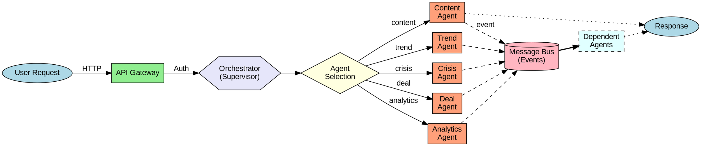
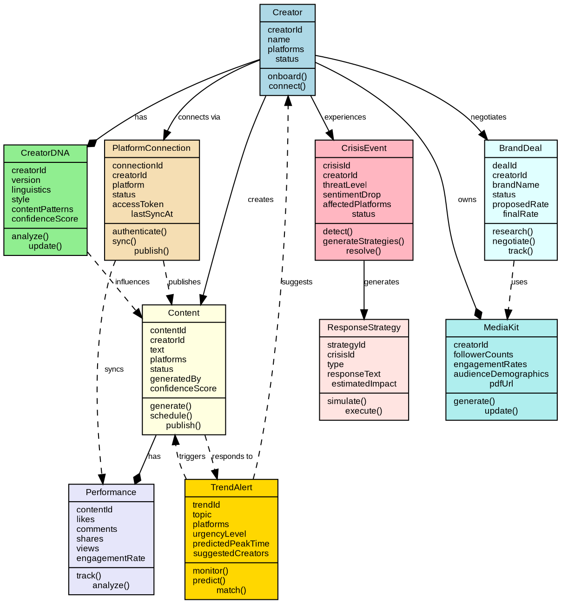
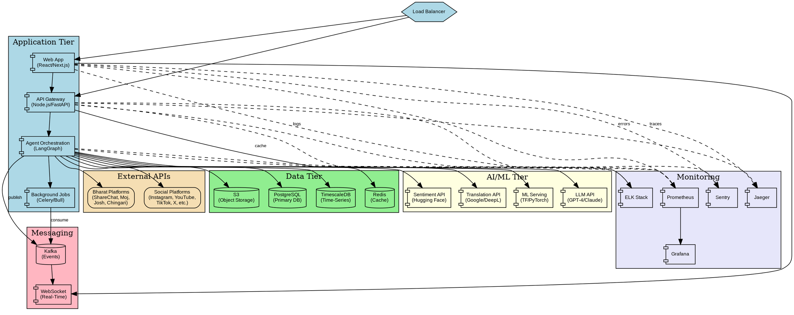

# Design Document: Nexus Solo

## Overview

Nexus Solo is a multi-agent AI command center that transforms how solopreneur creator managers operate. The system employs five specialized AI agents (Content, Trend, Crisis, Deal, Analytics) that collaborate through a message bus architecture to provide agency-level capabilities. Each agent maintains domain expertise while sharing context through a unified data layer.

The platform addresses three critical pain points: (1) time-intensive repetitive tasks through intelligent automation, (2) missed opportunities through predictive trend detection and brand deal intelligence, and (3) reactive crisis management through real-time sentiment monitoring with 8-minute detection targets.

**Key Design Principles:**
- **Agent Autonomy**: Each agent operates independently with specialized capabilities
- **Shared Context**: All agents access a unified Creator DNA and analytics data layer
- **Predictive First**: Forecast outcomes before they happen (content performance, crises, trends)
- **Bharat-Centric**: Regional language support and cultural context preservation as first-class features
- **Property-Based Correctness**: Universal properties validated through automated testing

## Architecture

### High-Level System Architecture

```
┌─────────────────────────────────────────────────────────────┐
│                    Command Center (Web UI)                  │
│  • Unified Inbox  • Content Calendar  • Crisis Dashboard    │
│  • Analytics View • Deal Pipeline     • Creator Switcher    │
└─────────────────────────────────────────────────────────────┘
                              ↓ REST API
┌─────────────────────────────────────────────────────────────┐
│                    API Gateway Layer                        │
│  • Authentication  • Rate Limiting  • Request Routing       │
└─────────────────────────────────────────────────────────────┘
                              ↓
┌─────────────────────────────────────────────────────────────┐
│                  Agent Orchestration Layer                  │
│                                                             │
│  ┌──────────────┐  ┌──────────────┐  ┌──────────────┐       │
│  │   Content    │  │    Trend     │  │    Crisis    │       │
│  │    Agent     │  │    Agent     │  │    Agent     │       │
│  └──────────────┘  └──────────────┘  └──────────────┘       │
│                                                             │
│  ┌──────────────┐  ┌──────────────┐                         │
│  │     Deal     │  │  Analytics   │                         │
│  │    Agent     │  │    Agent     │                         │
│  └──────────────┘  └──────────────┘                         │
│                                                             │
│              Message Bus (Event-Driven Communication)       │
└─────────────────────────────────────────────────────────────┘
                              ↓
┌─────────────────────────────────────────────────────────────┐
│                      Data Layer                             │
│                                                             │
│  ┌──────────────┐  ┌──────────────┐  ┌──────────────┐       │
│  │  Creator DNA │  │   Content    │  │  Analytics   │       │
│  │   Database   │  │   Database   │  │   Database   │       │
│  └──────────────┘  └──────────────┘  └──────────────┘       │
│                                                             │
│  ┌──────────────┐  ┌──────────────┐                         │
│  │    Crisis    │  │  Brand Deal  │                         │
│  │   Database   │  │   Database   │                         │
│  └──────────────┘  └──────────────┘                         │
└─────────────────────────────────────────────────────────────┘
                              ↓
┌─────────────────────────────────────────────────────────────┐
│              Platform Integration Layer                     │
│                                                             │
│  Global: Instagram, YouTube, TikTok, X, LinkedIn, Facebook  │
│  Bharat: ShareChat, Moj, Josh, Chingari                     │
│  Services: Sentiment API, Translation API, LLM API          │
└─────────────────────────────────────────────────────────────┘
```

### Multi-Agent Orchestration Pattern

The system uses a **Supervisor Pattern** with event-driven communication:

1. **Centralized Coordinator**: The orchestration layer routes tasks to appropriate agents based on task type
2. **Message Bus**: Agents publish events (e.g., "content_generated", "crisis_detected") that other agents can subscribe to
3. **Shared State**: All agents read from a unified data layer but write to domain-specific databases
4. **Async Execution**: Agents operate asynchronously to enable parallel processing

**Agent Communication Flow:**
```
User Request → API Gateway → Orchestrator → Agent Selection → Agent Execution
                                                    ↓
                                            Message Bus Event
                                                    ↓
                                        Dependent Agents React
```

**Framework Selection**: LangGraph for stateful workflow management
- Provides graph-based agent orchestration with state persistence
- Supports conditional routing based on agent outputs
- Enables human-in-the-loop checkpoints for critical decisions
- Better suited for complex, stateful workflows than CrewAI or AutoGen

### Agent Communication Flow Diagram



*To view: Copy the diagram code and paste into [Graphviz Online](https://dreampuf.github.io/GraphvizOnline/)*

## Components and Interfaces

### 1. Content Agent

**Responsibility**: Generate platform-specific content in each creator's authentic voice

**Core Capabilities:**
- Voice cloning using Creator DNA profiles
- Platform-specific formatting (character limits, hashtags, aspect ratios)
- Multi-lingual content generation with cultural context preservation
- Confidence scoring for style match accuracy

**Interface:**
```typescript
interface ContentAgent {
  generateContent(request: ContentRequest): Promise<ContentResponse>
  translateContent(content: Content, targetLanguage: RegionalLanguage): Promise<Content>
  scoreStyleMatch(content: Content, creatorId: string): Promise<number>
}

interface ContentRequest {
  creatorId: string
  platforms: Platform[]
  topic?: string
  trendId?: string
  language?: RegionalLanguage
}

interface ContentResponse {
  content: Map<Platform, GeneratedContent>
  confidenceScore: number
  suggestedPostTime: Date
  performancePrediction: number
}

interface GeneratedContent {
  text: string
  hashtags: string[]
  mentions: string[]
  mediaRequirements?: MediaSpec
}
```

**Dependencies:**
- Creator DNA Database (read)
- LLM API (GPT-4, Claude, or similar)
- Translation API for regional languages
- Analytics Agent (for performance prediction)

#### Content Generation Workflow

```dot
digraph ContentGenerationWorkflow {
  rankdir=TB;
  node [shape=box, style=rounded, fontname="Arial", fontsize=10];
  edge [fontname="Arial", fontsize=9];
  
  Start [label="Content\nRequest", shape=ellipse, fillcolor=lightblue, style=filled];
  Validate [label="Validate\nRequest", shape=diamond];
  LoadDNA [label="Load Creator\nDNA Profile", fillcolor=lightgreen, style=filled];
  CheckTrend [label="Trend-Based?", shape=diamond];
  LoadTrend [label="Load Trend\nData", fillcolor=lightyellow, style=filled];
  Generate [label="Generate Content\n(LLM)", fillcolor=lightsalmon, style=filled];
  Optimize [label="Platform\nOptimization", fillcolor=lightyellow, style=filled];
  Translate [label="Translate?", shape=diamond];
  DoTranslate [label="Translate\n(Preserve Culture)", fillcolor=lavender, style=filled];
  Score [label="Style Match\nScore", fillcolor=lightcyan, style=filled];
  Predict [label="Performance\nPrediction", fillcolor=plum, style=filled];
  CheckConf [label="Confidence\nOK?", shape=diamond];
  Flag [label="Flag for\nReview", fillcolor=lightpink, style=filled];
  Save [label="Save to\nDatabase", fillcolor=lightgray, style=filled];
  Publish [label="Publish Event", shape=cylinder, fillcolor=mistyrose, style=filled];
  End [label="Return\nResponse", shape=ellipse, fillcolor=lightblue, style=filled];
  Error [label="Error", shape=ellipse, fillcolor=lightpink, style=filled];
  
  Start -> Validate;
  Validate -> LoadDNA [label="valid"];
  Validate -> Error [label="invalid"];
  LoadDNA -> CheckTrend;
  CheckTrend -> LoadTrend [label="yes"];
  CheckTrend -> Generate [label="no"];
  LoadTrend -> Generate;
  Generate -> Optimize;
  Optimize -> Translate;
  Translate -> DoTranslate [label="yes"];
  Translate -> Score [label="no"];
  DoTranslate -> Score;
  Score -> Predict;
  Predict -> CheckConf;
  CheckConf -> Save [label="yes"];
  CheckConf -> Flag [label="no"];
  Flag -> Save;
  Save -> Publish;
  Publish -> End;
}
```



*Workflow shows: DNA loading → trend handling → LLM generation → platform optimization → translation → scoring → prediction*

### 2. Trend Agent

**Responsibility**: Monitor trends across platforms and identify viral opportunities in the Trend Window (6-12 hours before peak)

**Core Capabilities:**
- Real-time trend monitoring across all integrated platforms
- Trend velocity calculation to predict peak timing
- Creator-trend matching based on audience alignment
- Trend prediction accuracy tracking (target: 70%+)

**Interface:**
```typescript
interface TrendAgent {
  monitorTrends(): AsyncIterator<TrendAlert>
  predictTrendPeak(trendId: string): Promise<TrendPrediction>
  matchCreatorToTrend(trendId: string, creators: string[]): Promise<CreatorMatch[]>
  trackPredictionAccuracy(): Promise<AccuracyMetrics>
}

interface TrendAlert {
  trendId: string
  topic: string
  platforms: Platform[]
  currentVelocity: number
  predictedPeakTime: Date
  urgencyLevel: 'low' | 'medium' | 'high' | 'critical'
  suggestedCreators: string[]
}

interface TrendPrediction {
  peakTime: Date
  confidenceInterval: [Date, Date]
  expectedEngagement: number
}

interface CreatorMatch {
  creatorId: string
  alignmentScore: number
  audienceOverlap: number
  reasoning: string
}
```

**Dependencies:**
- Platform APIs (for trend data)
- Creator DNA Database (for matching)
- Analytics Database (for historical trend performance)

### 3. Crisis Agent

**Responsibility**: Monitor sentiment in real-time and detect PR threats within 8 minutes

**Core Capabilities:**
- Real-time sentiment analysis across all creator mentions
- Anomaly detection for abnormal sentiment shifts
- Crisis response simulation with outcome prediction
- Threat level classification (Low, Medium, High, Critical)

**Interface:**
```typescript
interface CrisisAgent {
  monitorSentiment(creatorId: string): AsyncIterator<SentimentUpdate>
  detectCrisis(sentimentHistory: SentimentScore[]): Promise<CrisisEvent | null>
  generateResponseStrategies(crisis: CrisisEvent): Promise<ResponseStrategy[]>
  simulateOutcome(strategy: ResponseStrategy): Promise<OutcomeSimulation>
}

interface SentimentUpdate {
  creatorId: string
  timestamp: Date
  sentimentScore: number  // -1.0 to 1.0
  source: Platform
  messageId: string
  text: string
}

interface CrisisEvent {
  crisisId: string
  creatorId: string
  detectedAt: Date
  threatLevel: 'low' | 'medium' | 'high' | 'critical'
  sentimentDrop: number
  affectedPlatforms: Platform[]
  triggeringMessages: string[]
  suggestedActions: string[]
}

interface ResponseStrategy {
  strategyId: string
  type: 'acknowledge' | 'apologize' | 'clarify' | 'ignore' | 'legal'
  responseText: string
  targetPlatforms: Platform[]
  estimatedImpact: OutcomeSimulation
}

interface OutcomeSimulation {
  predictedSentimentChange: number
  confidenceInterval: [number, number]
  riskLevel: 'low' | 'medium' | 'high'
  historicalSimilarity: number
}
```

**Dependencies:**
- Sentiment Analysis API (e.g., Hugging Face transformers)
- Platform APIs (for real-time comment/mention streams)
- Crisis Database (for historical crisis data)
- Notification Service (email, SMS, in-app)

#### Crisis Detection Workflow

```dot
digraph CrisisDetectionWorkflow {
  rankdir=TB;
  node [shape=box, style=rounded, fontname="Arial", fontsize=10];
  edge [fontname="Arial", fontsize=9];
  
  Start [label="Real-Time\nMonitoring", shape=ellipse, fillcolor=lightblue, style=filled];
  Stream [label="Stream Platform\nData", fillcolor=lightcyan, style=filled];
  Analyze [label="Analyze\nSentiment", fillcolor=lavender, style=filled];
  Update [label="Update 7-Day\nHistory", fillcolor=lightgray, style=filled];
  CheckAnomaly [label="Sentiment Drop\n>0.3 in 1hr?", shape=diamond];
  CalcThreat [label="Calculate\nThreat Level", fillcolor=lightyellow, style=filled];
  Classify [label="Classify\nThreat", shape=diamond];
  LogLow [label="Log Event\n(Low)", fillcolor=lightgreen, style=filled];
  CreateCrisis [label="Create Crisis\nEvent", fillcolor=lightpink, style=filled];
  GenStrategies [label="Generate 3-5\nStrategies", fillcolor=lightsalmon, style=filled];
  Simulate [label="Simulate\nOutcomes", fillcolor=plum, style=filled];
  Notify [label="Send\nNotifications", fillcolor=mistyrose, style=filled];
  Display [label="Display Alert\nBanner", fillcolor=lightcoral, style=filled];
  PublishEvent [label="Publish\nEvent", shape=cylinder, fillcolor=mistyrose, style=filled];
  Wait [label="Wait for\nResponse", shape=parallelogram, fillcolor=lightblue, style=filled];
  Execute [label="Execute\nStrategy", fillcolor=lightyellow, style=filled];
  Track [label="Track\nOutcome", fillcolor=lightcyan, style=filled];
  UpdateModels [label="Update\nModels", fillcolor=lavender, style=filled];
  End [label="Resolved", shape=ellipse, fillcolor=lightgreen, style=filled];
  
  Start -> Stream;
  Stream -> Analyze;
  Analyze -> Update;
  Update -> CheckAnomaly;
  CheckAnomaly -> CalcThreat [label="yes"];
  CheckAnomaly -> Stream [label="no", style=dashed];
  CalcThreat -> Classify;
  Classify -> LogLow [label="low"];
  Classify -> CreateCrisis [label="med/high/\ncritical"];
  LogLow -> Stream [style=dashed];
  CreateCrisis -> GenStrategies;
  GenStrategies -> Simulate;
  Simulate -> Notify;
  Notify -> Display;
  Display -> PublishEvent;
  PublishEvent -> Wait;
  Wait -> Execute;
  Execute -> Track;
  Track -> UpdateModels;
  UpdateModels -> End;
  
  {rank=same; CheckAnomaly; Note1}
  Note1 [label="Target: ≤8 min\ndetection", shape=note, fillcolor=yellow, style=filled];
  CheckAnomaly -> Note1 [style=dotted, arrowhead=none];
}
```



*Workflow shows: Real-time monitoring → sentiment analysis → anomaly detection (8-min target) → threat classification → strategy generation → outcome simulation*

### 4. Deal Agent

**Responsibility**: Handle brand partnership research, media kit generation, and negotiation workflows

**Core Capabilities:**
- Brand partnership rate benchmarking
- Automated media kit generation with live stats
- Email composition matching brand communication tone
- Deal conversion tracking and optimization

**Interface:**
```typescript
interface DealAgent {
  researchBrandDeal(brand: string, creatorId: string): Promise<DealResearch>
  generateMediaKit(creatorId: string, targetBrand?: string): Promise<MediaKit>
  composeOutreach(deal: DealResearch, tone: 'formal' | 'casual'): Promise<string>
  parseResponse(email: string): Promise<DealUpdate>
  suggestCounterOffer(currentOffer: number, research: DealResearch): Promise<CounterOffer>
}

interface DealResearch {
  suggestedRates: {
    percentile25: number
    percentile50: number
    percentile75: number
  }
  comparableCreators: string[]
  brandIndustry: string
  typicalRequirements: string[]
  negotiationTips: string[]
}

interface MediaKit {
  creatorId: string
  generatedAt: Date
  followerCounts: Map<Platform, number>
  engagementRates: Map<Platform, number>
  audienceDemographics: Demographics
  topPerformingContent: Content[]
  pdfUrl: string
}

interface CounterOffer {
  suggestedAmount: number
  reasoning: string
  negotiationScript: string
}
```

**Dependencies:**
- Web scraping service (for brand partnership data)
- Analytics Database (for creator statistics)
- PDF generation library
- LLM API (for email composition)

### 5. Analytics Agent

**Responsibility**: Predictive performance modeling and multi-armed bandit optimization

**Core Capabilities:**
- Content performance prediction (28% accuracy improvement target)
- Optimal posting time recommendations
- Multi-armed bandit algorithms for continuous learning
- 7-day engagement forecasting

**Interface:**
```typescript
interface AnalyticsAgent {
  predictPerformance(content: Content, creatorId: string): Promise<PerformancePrediction>
  suggestPostingTime(creatorId: string, platform: Platform): Promise<Date>
  forecastEngagement(creatorId: string, days: number): Promise<EngagementForecast>
  updateModels(actualPerformance: Performance): Promise<void>
  getOptimizationMetrics(): Promise<OptimizationMetrics>
}

interface PerformancePrediction {
  score: number  // 0-100
  expectedLikes: number
  expectedComments: number
  expectedShares: number
  confidenceInterval: [number, number]
  factors: PredictionFactor[]
}

interface PredictionFactor {
  name: string
  impact: number  // -1.0 to 1.0
  explanation: string
}

interface EngagementForecast {
  creatorId: string
  forecastPeriod: [Date, Date]
  projectedFollowerGrowth: number
  projectedEngagementRate: number
  confidenceLevel: number
  underperformingCategories: string[]
  suggestedPivots: string[]
}

interface OptimizationMetrics {
  explorationRate: number
  convergenceStatus: Map<string, boolean>  // per creator-platform combo
  averageAccuracy: number
  modelVersion: string
}
```

**Dependencies:**
- Analytics Database (historical performance data)
- Machine learning models (scikit-learn, TensorFlow, or PyTorch)
- Feature engineering pipeline

### 6. Command Center (Web UI)

**Responsibility**: Unified dashboard for managing all creators, content, and alerts

**Core Features:**
- Unified inbox (all platform messages)
- Drag-and-drop content calendar
- Real-time crisis alerts
- Predictive analytics dashboard
- Creator switcher (5-10 creators)

**Key UI Components:**
```typescript
interface CommandCenter {
  // Inbox Management
  getUnifiedInbox(filters: InboxFilters): Promise<Message[]>
  replyToMessage(messageId: string, response: string): Promise<void>
  markAsRead(messageIds: string[]): Promise<void>
  
  // Content Calendar
  getContentCalendar(dateRange: [Date, Date]): Promise<ScheduledContent[]>
  scheduleContent(content: Content, postTime: Date): Promise<void>
  bulkSchedule(contents: Content[], times: Date[]): Promise<void>
  
  // Crisis Dashboard
  getActiveCrises(): Promise<CrisisEvent[]>
  getCrisisHistory(creatorId: string): Promise<CrisisEvent[]>
  executeCrisisResponse(crisisId: string, strategyId: string): Promise<void>
  
  // Analytics View
  getDashboardMetrics(creatorId: string): Promise<DashboardMetrics>
  getPerformanceComparison(creatorIds: string[]): Promise<ComparisonData>
  
  // Creator Management
  switchCreator(creatorId: string): Promise<void>
  bulkOperation(operation: BulkOp, creatorIds: string[]): Promise<void>
}

interface DashboardMetrics {
  currentSentiment: number
  weeklyEngagement: number
  followerGrowth: number
  activeCrises: number
  pendingDeals: number
  contentPerformance: PerformanceMetrics
  successMetrics: SuccessMetrics
}

interface SuccessMetrics {
  timeSavedPercentage: number  // target: 85%
  dealConversionImprovement: number  // target: 40%
  crisisDetectionTime: number  // target: 8 minutes
  predictionAccuracy: number  // target: 28% improvement
}
```

## Data Models

### Creator DNA Profile

```typescript
interface CreatorDNA {
  creatorId: string
  version: number
  lastUpdated: Date
  
  // Linguistic Patterns
  linguistics: {
    averageSentenceLength: number
    sentenceLengthVariance: number
    vocabularyPreferences: Map<string, number>  // word -> frequency
    punctuationStyle: PunctuationProfile
    paragraphStructure: StructureProfile
  }
  
  // Style Characteristics
  style: {
    humorType: 'sarcastic' | 'wholesome' | 'dark' | 'observational' | 'none'
    tone: 'professional' | 'casual' | 'friendly' | 'authoritative'
    formalityLevel: number  // 0-10
    emojiUsage: EmojiProfile
  }
  
  // Content Patterns
  contentPatterns: {
    postingCadence: 'daily' | '3x_week' | 'weekly' | 'sporadic'
    preferredPostTimes: Date[]
    topicDistribution: Map<string, number>
    hashtagStrategy: HashtagProfile
  }
  
  // Platform-Specific Variations
  platformVariations: Map<Platform, StyleVariation>
  
  // Training Data
  analyzedPosts: number
  confidenceScore: number
}

interface EmojiProfile {
  frequency: number  // emojis per 100 words
  preferredEmojis: Map<string, number>
  placement: 'start' | 'end' | 'inline' | 'mixed'
}

interface HashtagProfile {
  averageCount: number
  placement: 'start' | 'end' | 'inline'
  popularHashtags: string[]
}
```

### Content Model

```typescript
interface Content {
  contentId: string
  creatorId: string
  createdAt: Date
  status: 'draft' | 'scheduled' | 'published' | 'failed'
  
  // Content Data
  text: string
  hashtags: string[]
  mentions: string[]
  media?: MediaAsset[]
  
  // Metadata
  platforms: Platform[]
  scheduledTime?: Date
  publishedTime?: Date
  language: string
  
  // AI Metadata
  generatedBy: 'human' | 'ai'
  confidenceScore?: number
  performancePrediction?: PerformancePrediction
  trendId?: string
  
  // Performance Data
  actualPerformance?: Performance
}

interface Performance {
  likes: number
  comments: number
  shares: number
  views: number
  engagementRate: number
  measuredAt: Date
}

interface MediaAsset {
  assetId: string
  type: 'image' | 'video' | 'carousel'
  url: string
  aspectRatio: string
  duration?: number
}
```

### Crisis Event Model

```typescript
interface CrisisEvent {
  crisisId: string
  creatorId: string
  detectedAt: Date
  resolvedAt?: Date
  status: 'active' | 'monitoring' | 'resolved' | 'escalated'
  
  // Crisis Details
  threatLevel: 'low' | 'medium' | 'high' | 'critical'
  sentimentDrop: number
  affectedPlatforms: Platform[]
  triggeringMessages: Message[]
  
  // Response
  selectedStrategy?: ResponseStrategy
  responseExecutedAt?: Date
  actualOutcome?: OutcomeData
  
  // Learning Data
  predictionAccuracy?: number
  lessonsLearned: string[]
}

interface OutcomeData {
  sentimentRecovery: number
  timeToResolve: number
  additionalDamage: boolean
  publicPerception: 'improved' | 'neutral' | 'worsened'
}
```

### Brand Deal Model

```typescript
interface BrandDeal {
  dealId: string
  creatorId: string
  brandName: string
  status: 'prospecting' | 'negotiating' | 'accepted' | 'rejected' | 'completed'
  
  // Deal Details
  proposedRate?: number
  finalRate?: number
  deliverables: string[]
  deadline?: Date
  
  // Research Data
  research: DealResearch
  mediaKit: MediaKit
  
  // Communication History
  emails: EmailThread[]
  lastContact: Date
  
  // Outcome
  conversionSuccess: boolean
  completedAt?: Date
}

interface EmailThread {
  emailId: string
  from: string
  to: string
  subject: string
  body: string
  sentAt: Date
  aiGenerated: boolean
}
```

### Platform Integration Model

```typescript
interface PlatformConnection {
  connectionId: string
  creatorId: string
  platform: Platform
  status: 'connected' | 'disconnected' | 'error'
  
  // Authentication
  accessToken: string  // encrypted
  refreshToken: string  // encrypted
  tokenExpiry: Date
  
  // Sync Status
  lastSyncAt: Date
  syncFrequency: number  // minutes
  
  // Permissions
  permissions: Permission[]
  
  // Rate Limiting
  rateLimitRemaining: number
  rateLimitReset: Date
}

type Platform = 
  | 'instagram' 
  | 'youtube' 
  | 'tiktok' 
  | 'x' 
  | 'linkedin' 
  | 'facebook'
  | 'sharechat' 
  | 'moj' 
  | 'josh' 
  | 'chingari'

type RegionalLanguage = 
  | 'hindi' 
  | 'tamil' 
  | 'telugu' 
  | 'bengali' 
  | 'marathi' 
  | 'gujarati' 
  | 'kannada' 
  | 'malayalam' 
  | 'punjabi' 
  | 'odia'
```

### Data Model Relationships Diagram



*Entity relationships showing: Creator as central entity → DNA profiles → Content generation → Performance tracking → Crisis/Deal/Trend workflows*

## Correctness Properties

*A property is a characteristic or behavior that should hold true across all valid executions of a system—essentially, a formal statement about what the system should do. Properties serve as the bridge between human-readable specifications and machine-verifiable correctness guarantees.*


### Agent System Properties

Property 1: Agent action logging completeness
*For any* agent task execution, the system should log an entry containing both the agent identifier and a timestamp.
**Validates: Requirements 1.2**

Property 2: Concurrent data access integrity
*For any* creator data accessed by multiple agents simultaneously, the data should remain uncorrupted and consistent across all agent reads.
**Validates: Requirements 1.3**

Property 3: Agent output metadata completeness
*For any* agent-generated output, the output should include both an agent identifier tag and a confidence score.
**Validates: Requirements 1.4**

Property 4: Message bus communication
*For any* message published by an agent to the message bus, all subscribed agents should be able to receive and process that message.
**Validates: Requirements 1.5**

### Creator DNA Properties

Property 5: DNA profile initialization completeness
*For any* creator onboarding with at least 50 historical posts, the system should generate a Creator_DNA profile containing all required fields (tone, humor type, emoji patterns, sentence structure, vocabulary preferences, punctuation style, posting cadence).
**Validates: Requirements 2.1, 2.2**

Property 6: DNA-based content generation
*For any* content generation request, the Content_Agent should reference the creator's Creator_DNA profile, and the generated content should match the creator's linguistic patterns within 20% variance.
**Validates: Requirements 2.3**

Property 7: DNA profile updates
*For any* new content published by a creator, the system should update that creator's Creator_DNA profile within 24 hours.
**Validates: Requirements 2.4**

Property 8: DNA profile isolation
*For any* two distinct creators, their Creator_DNA profiles should remain separate with no cross-contamination of style patterns or linguistic features.
**Validates: Requirements 2.5**

### Content Generation Properties

Property 9: Platform-optimized content generation
*For any* content generation request targeting specific platforms, the generated content should meet all platform requirements (character limits, hashtag conventions, aspect ratios, and platform-specific best practices).
**Validates: Requirements 3.1, 3.2, 9.5**

Property 10: Generated content confidence scoring
*For any* AI-generated content, the system should include a confidence score indicating style match accuracy.
**Validates: Requirements 3.3**

Property 11: Multi-lingual content generation
*For any* content generation request specifying a Regional_Language, the output language should match the requested language.
**Validates: Requirements 3.4**

### Performance Prediction Properties

Property 12: Prediction generation latency
*For any* content creation or upload event, the Analytics_Agent should generate a Performance_Prediction score within 5 seconds.
**Validates: Requirements 4.1**

Property 13: Prediction accuracy improvement
*For any* set of at least 100 predictions, the system's prediction accuracy should be at least 28% better than a random baseline.
**Validates: Requirements 4.4**

Property 14: Performance tracking and model updates
*For any* published post, the system should track actual performance metrics and trigger prediction model updates.
**Validates: Requirements 4.5**

### Trend Detection Properties

Property 15: Real-time trend monitoring
*For any* integrated platform, the Trend_Agent should actively monitor trending topics with a polling frequency sufficient for real-time detection.
**Validates: Requirements 5.1**

Property 16: Trend window alert generation
*For any* topic entering the Trend_Window (6-12 hours before peak), the Trend_Agent should generate an alert with an urgency level classification.
**Validates: Requirements 5.2**

Property 17: Creator-trend matching
*For any* detected trend, the Trend_Agent should suggest at least one creator match based on audience alignment and Creator_DNA compatibility.
**Validates: Requirements 5.3**

Property 18: Rapid trend content generation
*For any* accepted trend alert, the Content_Agent should generate platform-specific content within 2 minutes.
**Validates: Requirements 5.4**

Property 19: Trend content authenticity
*For any* generated trend content, the content should both incorporate the trending topic and maintain the creator's authentic voice patterns from their Creator_DNA.
**Validates: Requirements 5.5**

Property 20: Multi-platform trend content generation
*For any* trend content request targeting multiple platforms, the system should generate content variations for all requested platforms with appropriate hashtags and mentions.
**Validates: Requirements 5.6**

Property 21: Trend prediction accuracy
*For any* set of at least 50 trend predictions, the system should maintain 70% or higher accuracy in predicting trend peaks.
**Validates: Requirements 5.8**

### Crisis Management Properties

Property 22: Real-time sentiment monitoring
*For any* creator with connected platforms, the Crisis_Agent should analyze sentiment for all incoming comments, mentions, and replies in real-time.
**Validates: Requirements 6.1, 12.1**

Property 23: Threat level calculation
*For any* detected abnormal negative sentiment pattern, the Crisis_Agent should calculate and assign a threat level (Low, Medium, High, or Critical).
**Validates: Requirements 6.2**

Property 24: Crisis notification delivery
*For any* Crisis_Event with Medium or higher threat level, the system should send immediate notifications via all enabled channels (email, SMS, in-app).
**Validates: Requirements 6.3**

Property 25: Crisis detection latency
*For any* Crisis_Event, the time from initial negative sentiment spike to detection should be 8 minutes or less.
**Validates: Requirements 6.4, 18.3**

Property 26: Crisis response strategy generation
*For any* detected Crisis_Event, the Crisis_Agent should generate between 3 and 5 distinct response strategies.
**Validates: Requirements 6.5, 14.1**

Property 27: Response outcome simulation
*For any* generated response strategy, the Crisis_Agent should simulate potential outcomes using historical crisis data.
**Validates: Requirements 6.6, 14.2**

Property 28: Crisis outcome tracking
*For any* executed crisis response, the system should track the actual outcome and compare it against the predicted outcome.
**Validates: Requirements 6.7, 14.4**

Property 29: Simulation model updates
*For any* month with completed crisis resolutions, the Crisis_Agent should update simulation models based on actual crisis resolution data.
**Validates: Requirements 14.5**

Property 30: Sentiment history retention
*For any* creator, the system should maintain a rolling 7-day sentiment history.
**Validates: Requirements 12.3**

Property 31: Sentiment anomaly detection
*For any* sentiment shift exceeding 0.3 points within 1 hour, the Crisis_Agent should flag it as an anomaly.
**Validates: Requirements 12.4**

### Brand Deal Properties

Property 32: Deal rate benchmarking
*For any* identified Brand_Deal opportunity, the Deal_Agent should research comparable partnerships and suggest rate ranges at 25th, 50th, and 75th percentiles.
**Validates: Requirements 7.1**

Property 33: Media kit completeness
*For any* generated media kit, it should include follower counts, engagement rates, audience demographics, and top-performing content.
**Validates: Requirements 7.2**

Property 34: Media kit data freshness
*For any* media kit request, the included statistics should have been updated within the last 24 hours.
**Validates: Requirements 7.3**

Property 35: Automatic media kit regeneration
*For any* creator whose statistics change by more than 10%, the system should automatically regenerate their media kit.
**Validates: Requirements 7.4**

Property 36: Brand-specific media kit customization
*For any* two media kits targeting different brand industries, the content should differ based on industry-specific requirements.
**Validates: Requirements 7.5**

Property 37: Deal conversion tracking
*For any* set of at least 20 brand deals, the system should track conversion rates and demonstrate 40% improvement over baseline.
**Validates: Requirements 7.7, 18.2**

Property 38: Brand response parsing
*For any* brand response email, the Deal_Agent should parse the response and generate suggested next steps or counter-offers.
**Validates: Requirements 7.8**

Property 39: Automatic rate updates
*For any* creator whose metrics improve significantly, the system should automatically update suggested deal rates.
**Validates: Requirements 7.9**

### Command Center Properties

Property 40: Unified inbox aggregation
*For any* connected platform, all messages (direct messages, comments, mentions) should appear in the unified inbox.
**Validates: Requirements 8.1**

Property 41: Inline performance prediction display
*For any* scheduled content displayed in the calendar, the Performance_Prediction score should be shown inline.
**Validates: Requirements 8.3, 4.3**

Property 42: Crisis alert display
*For any* active Crisis_Event, the Command_Center should display a prominent alert banner with threat level and recommended actions.
**Validates: Requirements 8.4**

Property 43: Command Center data latency
*For any* data update in the system, the Command_Center should reflect the change within 30 seconds maximum.
**Validates: Requirements 8.6**

### Platform Integration Properties

Property 44: API failure retry with exponential backoff
*For any* platform API failure, the system should queue the operation and retry with exponentially increasing delays.
**Validates: Requirements 10.3**

Property 45: Rate limit compliance
*For any* platform with defined rate limits, the system should never exceed those limits when posting content or making API calls.
**Validates: Requirements 10.5**

Property 46: Platform data sync frequency
*For any* connected platform, the system should sync data (followers, engagement, comments) at least every 15 minutes.
**Validates: Requirements 10.6**

### Content Scheduling Properties

Property 47: Multi-platform scheduling
*For any* content scheduling request, the system should allow simultaneous selection and scheduling to multiple platforms.
**Validates: Requirements 11.1**

Property 48: Optimal posting time suggestions
*For any* creator-platform combination, the Analytics_Agent should generate optimal posting time suggestions based on historical engagement patterns.
**Validates: Requirements 11.2**

Property 49: Publication timing accuracy
*For any* scheduled content, the actual publication time should be within 60 seconds of the scheduled time.
**Validates: Requirements 11.3**

Property 50: Publication retry logic
*For any* failed publication attempt, the system should retry up to 3 times, and if all attempts fail, notify the manager.
**Validates: Requirements 11.4**

Property 51: Bulk scheduling capacity
*For any* bulk scheduling operation, the system should successfully schedule up to 50 posts in a single operation.
**Validates: Requirements 11.5**

### Multi-Armed Bandit Properties

Property 52: Exploration-exploitation balance
*For any* posting time optimization cycle, the system should test new posting times (exploration) while also using proven high-performing times (exploitation).
**Validates: Requirements 13.2**

Property 53: Performance-based recommendation updates
*For any* posting time slot with tracked performance data, the system should adjust recommendations weekly based on actual performance.
**Validates: Requirements 13.3**

Property 54: Optimization convergence
*For any* creator-platform combination with at least 30 posts per time slot, the system should converge on optimal posting windows.
**Validates: Requirements 13.4**

Property 55: Model isolation per creator-platform
*For any* two distinct creator-platform combinations, the optimization models should be maintained separately without cross-influence.
**Validates: Requirements 13.5**

### Inbox Management Properties

Property 56: Cross-platform message aggregation
*For any* message (direct message, comment, or mention) from any connected platform, it should appear in the unified inbox with source platform, creator, and timestamp metadata.
**Validates: Requirements 15.1, 15.2**

Property 57: Message filtering functionality
*For any* inbox filter (platform, creator, message type, read/unread status), applying the filter should correctly filter the message list.
**Validates: Requirements 15.3**

Property 58: Reply routing accuracy
*For any* manager reply to a message, the response should be posted to the correct platform and thread.
**Validates: Requirements 15.4**

Property 59: Read status synchronization
*For any* message marked as read or unread, the status should sync across all devices within 30 seconds.
**Validates: Requirements 15.5**

### Predictive Analytics Properties

Property 60: Engagement trend forecasting
*For any* creator, the Analytics_Agent should generate a 7-day engagement trend forecast.
**Validates: Requirements 16.1**

Property 61: Prediction metadata completeness
*For any* displayed prediction, the system should include confidence intervals and historical accuracy metrics.
**Validates: Requirements 16.3**

Property 62: Underperformance identification
*For any* analytics run, the Analytics_Agent should identify underperforming content categories and generate strategic pivot suggestions.
**Validates: Requirements 16.4**

Property 63: Prediction accuracy tracking
*For any* week with published content, the system should compare predicted vs actual performance and display accuracy metrics.
**Validates: Requirements 16.5**

### Security Properties

Property 64: Credential encryption at rest
*For any* stored creator credential or API token, it should be encrypted using AES-256 encryption.
**Validates: Requirements 17.1**

Property 65: Data encryption in transit
*For any* data transmission, the system should use TLS 1.3 or higher for encryption.
**Validates: Requirements 17.2**

Property 66: PII anonymization in DNA profiles
*For any* Creator_DNA profile, personally identifiable information should be anonymized.
**Validates: Requirements 17.3**

Property 67: Role-based access control
*For any* multi-user account, the system should enforce role-based permissions correctly.
**Validates: Requirements 17.4**

Property 68: Data deletion compliance
*For any* creator removal request, all associated data should be permanently deleted within 30 days.
**Validates: Requirements 17.5**

### Performance Metrics Properties

Property 69: Time savings tracking
*For any* measurement period, the system should track time saved compared to manual workflows with a target of 85% reduction.
**Validates: Requirements 18.1**

Property 70: Prediction accuracy baseline improvement
*For any* set of at least 100 predictions, the system should demonstrate 28% improvement in accuracy over a random baseline.
**Validates: Requirements 18.4**

### Onboarding Properties

Property 71: Historical post import
*For any* creator onboarding, the system should automatically import the last 50 posts from each connected platform.
**Validates: Requirements 19.2**

Property 72: DNA analysis completion time
*For any* creator addition, the system should complete initial DNA analysis within 5 minutes.
**Validates: Requirements 19.3**

Property 73: Onboarding readiness score
*For any* completed onboarding, the system should display a readiness score indicating when the creator is ready for AI-generated content.
**Validates: Requirements 19.5**

### Notification Properties

Property 74: High-severity crisis notifications
*For any* Crisis_Event with High or Critical threat level, the system should send notifications via all enabled channels.
**Validates: Requirements 20.2**

Property 75: Notification preference enforcement
*For any* configured notification preference, the system should respect the preference when sending notifications.
**Validates: Requirements 20.3**

Property 76: Deal opportunity notifications
*For any* detected Brand_Deal opportunity, the system should send a notification with opportunity details.
**Validates: Requirements 20.4**

Property 77: Low-priority notification batching
*For any* low-priority notification, the system should batch it with others and send a daily digest email.
**Validates: Requirements 20.5**

### Multi-Account Management Properties

Property 78: Creator account capacity
*For any* manager account, the system should support managing between 5 and 10 creator accounts simultaneously.
**Validates: Requirements 21.1**

Property 79: Creator filtering and grouping
*For any* Command_Center view, the system should allow filtering and grouping by creator.
**Validates: Requirements 21.2**

Property 80: Per-creator data isolation
*For any* creator account, the system should maintain separate Creator_DNA profiles, content calendars, and analytics without cross-contamination.
**Validates: Requirements 21.3**

Property 81: Creator view switching performance
*For any* creator view switch, the interface should update within 2 seconds.
**Validates: Requirements 21.4**

Property 82: Cross-creator bulk operations
*For any* bulk operation request targeting multiple creators, the system should execute the operation across all specified creators.
**Validates: Requirements 21.5**

Property 83: Per-creator resource tracking
*For any* creator account, the system should track resource usage separately to enable fair billing and quota management.
**Validates: Requirements 21.6**

Property 84: Non-disruptive creator additions
*For any* new creator addition, existing creator workflows and data should remain unaffected.
**Validates: Requirements 21.7**

### API Properties

Property 85: API rate limiting enforcement
*For any* API key, the system should enforce a rate limit of 1000 requests per hour.
**Validates: Requirements 22.2**

Property 86: Webhook event delivery
*For any* system event (new post, crisis detected, etc.), registered webhooks should be triggered with event data.
**Validates: Requirements 22.3**

Property 87: API response format consistency
*For any* API response, it should be in JSON format with consistent error handling and appropriate HTTP status codes.
**Validates: Requirements 22.4**

## Error Handling

### Error Categories and Strategies

**1. Platform API Failures**
- **Detection**: HTTP error codes (4xx, 5xx), timeout exceptions, connection errors
- **Strategy**: Exponential backoff retry (3 attempts), queue operations for later retry, notify manager if all retries fail
- **Graceful Degradation**: Continue operating with cached data, mark platform as temporarily unavailable

**2. AI Model Failures**
- **Detection**: LLM API errors, timeout, rate limiting, invalid responses
- **Strategy**: Fallback to alternative models, use cached predictions, reduce confidence scores
- **Graceful Degradation**: Notify user that AI features are degraded, allow manual content creation

**3. Data Corruption**
- **Detection**: Schema validation failures, checksum mismatches, concurrent write conflicts
- **Strategy**: Rollback to last known good state, log corruption event, alert administrators
- **Prevention**: Use database transactions, implement optimistic locking for concurrent access

**4. Crisis Detection False Positives**
- **Detection**: User feedback, manual review, historical pattern analysis
- **Strategy**: Adjust sensitivity thresholds, improve sentiment analysis models, learn from feedback
- **Mitigation**: Provide "dismiss false alarm" option, track false positive rate

**5. Performance Degradation**
- **Detection**: Response time monitoring, queue depth alerts, resource utilization metrics
- **Strategy**: Scale horizontally (add agent instances), implement caching, optimize database queries
- **Graceful Degradation**: Prioritize critical features (crisis detection), defer non-urgent tasks

**6. Authentication Failures**
- **Detection**: OAuth token expiry, invalid credentials, platform API changes
- **Strategy**: Automatic token refresh, prompt user for re-authentication, maintain refresh token rotation
- **User Communication**: Clear error messages, guided re-authentication flow

**7. Translation Errors**
- **Detection**: Language detection failures, unsupported language pairs, cultural context loss
- **Strategy**: Fallback to English, flag for manual review, use multiple translation services
- **Quality Assurance**: Confidence scoring for translations, human review for critical content

### Error Logging and Monitoring

**Structured Logging Format**:
```typescript
interface ErrorLog {
  errorId: string
  timestamp: Date
  severity: 'low' | 'medium' | 'high' | 'critical'
  component: string  // agent name or system component
  errorType: string
  errorMessage: string
  stackTrace?: string
  context: Record<string, any>
  userId?: string
  creatorId?: string
  recoveryAction?: string
}
```

**Monitoring Metrics**:
- Error rate per component (target: <1% of operations)
- Mean time to recovery (MTTR)
- False positive rate for crisis detection (target: <10%)
- API failure rate per platform
- Model prediction confidence distribution

**Alerting Thresholds**:
- Critical: System-wide failures, data corruption, security breaches
- High: Agent failures, platform API outages, crisis detection failures
- Medium: Performance degradation, high error rates, model accuracy drops
- Low: Individual operation failures, transient errors

## Testing Strategy

### Dual Testing Approach

The system requires both **unit testing** and **property-based testing** for comprehensive coverage:

**Unit Tests**: Focus on specific examples, edge cases, and integration points
- Example: Test that a specific creator's DNA profile contains expected fields
- Example: Test that Instagram content respects 2,200 character limit
- Example: Test that crisis alert UI displays correctly for a known crisis event
- Edge cases: Empty content, missing fields, null values, boundary conditions
- Integration: Test platform API integration with mock responses

**Property-Based Tests**: Verify universal properties across all inputs
- Generate random creator data and verify DNA profiles are always complete
- Generate random content and verify platform requirements are always met
- Generate random sentiment patterns and verify crisis detection always triggers within 8 minutes
- Comprehensive input coverage through randomization (minimum 100 iterations per test)

### Property-Based Testing Configuration

**Framework Selection**:
- **Python**: Hypothesis library for property-based testing
- **TypeScript**: fast-check library for property-based testing

**Test Configuration**:
```python
# Python example with Hypothesis
from hypothesis import given, settings
import hypothesis.strategies as st

@settings(max_examples=100)  # Minimum 100 iterations
@given(creator_data=st.creator_profiles())
def test_dna_profile_completeness(creator_data):
    """
    Feature: nexus-solo, Property 5: DNA profile initialization completeness
    For any creator onboarding with at least 50 historical posts, 
    the system should generate a Creator_DNA profile containing all required fields.
    """
    dna_profile = create_dna_profile(creator_data)
    assert dna_profile.has_all_required_fields()
    assert dna_profile.confidence_score > 0.7
```

```typescript
// TypeScript example with fast-check
import fc from 'fast-check';

describe('Content Generation Properties', () => {
  it('Property 9: Platform-optimized content generation', () => {
    /**
     * Feature: nexus-solo, Property 9: Platform-optimized content generation
     * For any content generation request targeting specific platforms,
     * the generated content should meet all platform requirements.
     */
    fc.assert(
      fc.property(
        fc.contentRequest(),
        async (request) => {
          const content = await contentAgent.generateContent(request);
          for (const [platform, generated] of content.content) {
            expect(generated).toMeetPlatformRequirements(platform);
          }
        }
      ),
      { numRuns: 100 }  // Minimum 100 iterations
    );
  });
});
```

**Test Tagging Convention**:
Every property-based test MUST include a comment tag referencing the design document property:
```
Feature: {feature_name}, Property {number}: {property_text}
```

### Test Coverage Goals

**Unit Test Coverage**:
- Code coverage: 80% minimum
- Focus areas: Error handling, edge cases, integration points
- Critical paths: Crisis detection, content generation, platform publishing

**Property Test Coverage**:
- All 87 correctness properties must have corresponding property-based tests
- Each property test runs minimum 100 iterations
- Properties cover: data integrity, timing constraints, accuracy metrics, security requirements

### Testing Environments

**Local Development**:
- Mock platform APIs for fast iteration
- In-memory databases for speed
- Reduced property test iterations (50) for quick feedback

**CI/CD Pipeline**:
- Full property test iterations (100+)
- Integration tests with platform API sandboxes
- Performance benchmarking
- Security scanning

**Staging**:
- Real platform API integration (test accounts)
- Full-scale property testing (1000+ iterations)
- Load testing with realistic data volumes
- End-to-end workflow validation

### Performance Testing

**Load Testing Scenarios**:
- 10 creators with 100 posts each
- 1000 concurrent sentiment analysis operations
- 50 simultaneous content generation requests
- 100 platform API calls per minute

**Performance Targets**:
- Content generation: <5 seconds for performance prediction
- Crisis detection: <8 minutes from sentiment spike
- Trend content generation: <2 minutes
- API response time: <500ms for 95th percentile
- Dashboard data refresh: <30 seconds

### Security Testing

**Security Test Categories**:
- Authentication and authorization testing
- Encryption verification (at rest and in transit)
- SQL injection and XSS prevention
- API rate limiting enforcement
- Data anonymization validation
- GDPR compliance (data deletion)

**Penetration Testing**:
- Quarterly security audits
- Automated vulnerability scanning
- Third-party security assessment

## Deployment Architecture

### Infrastructure Components

**Application Tier**:
- Web application (React/Next.js frontend)
- API Gateway (Node.js/Express or Python/FastAPI)
- Agent orchestration service (LangGraph)
- Background job processors (Celery or Bull)

**Data Tier**:
- Primary database: PostgreSQL (creator data, content, analytics)
- Time-series database: TimescaleDB (sentiment history, performance metrics)
- Cache layer: Redis (session data, frequently accessed DNA profiles)
- Object storage: S3 (media assets, generated PDFs)

**AI/ML Tier**:
- LLM API integration (OpenAI GPT-4, Anthropic Claude)
- Sentiment analysis service (Hugging Face transformers)
- Translation service (Google Translate API or DeepL)
- ML model serving (TensorFlow Serving or PyTorch Serve)

**Message Bus**:
- Event streaming: Apache Kafka or RabbitMQ
- Real-time updates: WebSocket server

**Monitoring and Observability**:
- Metrics: Prometheus + Grafana
- Logging: ELK Stack (Elasticsearch, Logstash, Kibana)
- Tracing: Jaeger or OpenTelemetry
- Error tracking: Sentry

### Scalability Considerations

**Horizontal Scaling**:
- Stateless API servers (scale based on request load)
- Agent workers (scale based on queue depth)
- Database read replicas (scale based on query load)

**Vertical Scaling**:
- ML model inference (GPU instances for faster predictions)
- Database primary (scale for write throughput)

**Caching Strategy**:
- Creator DNA profiles (1-hour TTL)
- Platform data (15-minute TTL)
- Performance predictions (5-minute TTL)
- Trend data (1-minute TTL)

**Rate Limiting**:
- Per-user API limits (1000 requests/hour)
- Per-platform API limits (respect platform quotas)
- Agent task limits (prevent resource exhaustion)

### Disaster Recovery

**Backup Strategy**:
- Database: Daily full backups, hourly incremental backups
- Retention: 30 days for production data
- Geographic redundancy: Multi-region backup storage

**Recovery Procedures**:
- RTO (Recovery Time Objective): 4 hours
- RPO (Recovery Point Objective): 1 hour
- Automated failover for critical services
- Regular disaster recovery drills (quarterly)

### Deployment Architecture Diagram



*Infrastructure showing: Load balancer → Application tier (Web/API/Agents) → Data tier (PostgreSQL/TimescaleDB/Redis/S3) → AI/ML tier → Messaging (Kafka/WebSocket) → Monitoring stack → External platform APIs*

## Future Enhancements

**Phase 2 Features**:
- Video content generation using AI video tools
- Voice cloning for audio content (podcasts, voice-overs)
- Automated A/B testing for content variations
- Competitor analysis and benchmarking
- Advanced audience segmentation

**Phase 3 Features**:
- Multi-language voice cloning for regional content
- Automated video editing and thumbnail generation
- Influencer collaboration matching
- Revenue optimization recommendations
- White-label solution for agencies

**Research Areas**:
- Improved cultural context preservation in translations
- Better sarcasm and humor detection in sentiment analysis
- Predictive crisis modeling with higher accuracy
- Autonomous negotiation agents for brand deals
- Federated learning for privacy-preserving DNA profiles
